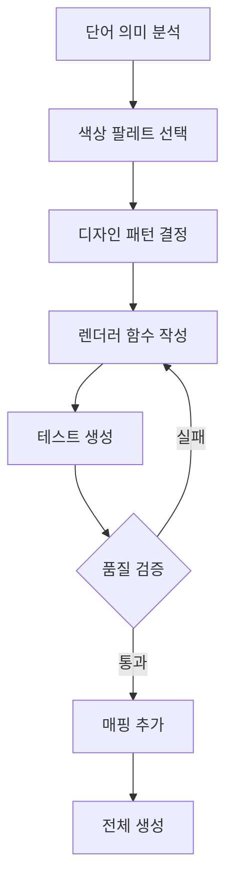
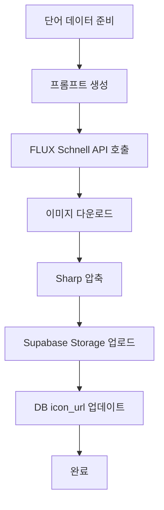

# 🎨 JPG 아이콘 마스터 가이드

**최종 업데이트**: 2025-10-26
**상태**: ✅ 운영 중
**방식**: Canvas API 직접 생성 + AI 생성 (FLUX Schnell)

---

## 📚 목차

1. [개요](#1-개요)
2. [빠른 시작](#2-빠른-시작)
3. [가이드라인 요약](#3-가이드라인-요약)
4. [워크플로우](#4-워크플로우)
5. [문제 해결](#5-문제-해결)
6. [품질 관리](#6-품질-관리)
7. [AI 이미지 생성 (NEW)](#7-ai-이미지-생성-new)
8. [참고 문서](#8-참고-문서)

---

## 1. 개요

### 1.1 JPG 직접 생성 방식

**기존 방식 (SVG)**:
- ❌ Claude API로 SVG 코드 텍스트 생성
- ❌ Gradient ID 충돌 문제
- ❌ 제한된 색상 표현
- ❌ API 비용 발생

**새로운 방식 (JPG)**:
- ✅ Canvas API로 직접 프로그래밍
- ✅ 풍부한 색감과 그라디언트
- ✅ 더 예술적인 표현
- ✅ 외부 API 불필요
- ✅ 무료

### 1.2 핵심 원칙

| 원칙 | 설명 | 중요도 |
|------|------|--------|
| **파스텔 색감** | 흰색이 섞인 부드러운 색상만 사용 | ⭐⭐⭐⭐⭐ |
| **화려함** | 2-4개 색상의 다채로운 그라디언트 | ⭐⭐⭐⭐⭐ |
| **밝은 색상** | 최소 70% 밝기 (180/255) | ⭐⭐⭐⭐⭐ |
| **예술적 표현** | 단어 의미를 상징적으로 표현 | ⭐⭐⭐⭐ |

### 1.3 기대 효과

- 🎨 **더 풍부한 색감**: JPG는 SVG보다 다양한 색상 표현 가능
- ✨ **화려한 그라디언트**: Canvas의 방사형/선형 그라디언트 자유롭게 사용
- 🖼️ **예술적 자유도**: 프로그래밍으로 복잡한 패턴도 구현 가능
- 💰 **비용 절감**: Claude API 사용 안함

---

## 2. 빠른 시작

### 2.1 설치

```bash
# Canvas 라이브러리 설치
npm install canvas

# 타입 정의 (선택)
npm install --save-dev @types/node
```

### 2.2 첫 아이콘 생성

```bash
# 전체 단어 생성 (창세기 1:1)
npx tsx scripts/icons/generateDirectJpg.ts

# 결과 확인
ls -lh output/direct_jpg/

# 브라우저에서 확인
open output/direct_jpg/bereshit.jpg
```

### 2.3 생성 결과 예시

```
output/direct_jpg/
├── bereshit.jpg    # 29 KB - 태초에 (황금 태양)
├── bara.jpg        # 35 KB - 창조하다 (폭발 입자)
├── elohim.jpg      # 15 KB - 하나님 (신성한 후광)
├── hashamayim.jpg  # 28 KB - 하늘 (구름과 별)
├── haaretz.jpg     # 24 KB - 땅 (언덕과 나무)
├── et.jpg          # 45 KB - 목적격 조사 (흐르는 리본)
└── veet.jpg        # 45 KB - 그리고 (연결 리본)
```

---

## 3. 가이드라인 요약

### 3.1 색상 규정

#### ✅ 권장 색상 (파스텔)

```javascript
const RECOMMENDED_COLORS = {
  // 신성함
  gold: '#FFD700',
  peach: '#FFE5B4',
  cream: '#FFF9E6',

  // 하늘
  skyBlue: '#87CEEB',
  powderBlue: '#B0E0E6',
  aliceBlue: '#F0F8FF',

  // 생명
  lightPink: '#FFB6C1',
  hotPink: '#FF69B4',
  lavenderBlush: '#FFF0F5',

  // 자연
  lightGreen: '#90EE90',
  paleGreen: '#98FB98',
  mintCream: '#F5FFFA',

  // 영성
  lavender: '#E1BEE7',
  plum: '#DDA0DD',
  thistle: '#D8BFD8'
}
```

#### ❌ 금지 색상 (어두운 색)

```javascript
const FORBIDDEN_COLORS = {
  // 절대 사용 금지
  black: '#000000',
  darkGray: '#1C1C1C',
  navy: '#000428',
  darkBrown: '#3E2723',
  darkGreen: '#1B5E20'
}
```

### 3.2 디자인 패턴

| 패턴 | 용도 | 색상 | 예시 단어 |
|------|------|------|----------|
| **방사형 후광** | 신성함, 중요함 | 골드, 화이트 | 하나님, 태초 |
| **그라디언트 배경** | 풍경, 분위기 | 하늘색, 그린 | 하늘, 땅 |
| **입자 효과** | 창조, 에너지 | 다채로운 | 창조하다 |
| **흐르는 리본** | 연결, 흐름 | 무지개 | 목적격 조사 |
| **자연 요소** | 땅, 생명 | 그린, 브라운 | 나무, 꽃 |

### 3.3 기술 요구사항

| 항목 | 값 | 비고 |
|------|-----|------|
| **해상도** | 512x512px | 고정 |
| **포맷** | JPG | PNG보다 작은 파일 |
| **Quality** | 95 | 0-100 범위 |
| **파일 크기** | 15-50 KB | 최적화 |
| **밝기** | 최소 180/255 | 70% 이상 |

---

## 4. 워크플로우

### 4.1 신규 단어 아이콘 생성



#### 단계별 상세

**1단계: 단어 의미 분석**
```typescript
// 예: בָּרָא (바라 - 창조하다)
의미: 창조, 만들다, 형성하다
카테고리: 동사, 행위
이미지: 폭발, 에너지, 입자, 빛
```

**2단계: 색상 팔레트 선택**
```typescript
// 창조 = 다채로운 에너지
const colors = {
  primary: '#FF69B4',    // 핑크 (생명)
  secondary: '#4FC3F7',  // 블루 (하늘)
  accent: '#FFD700',     // 골드 (신성)
  background: '#F3E5F5'  // 라벤더 (배경)
}
```

**3단계: 디자인 패턴 결정**
- 배경: 파스텔 그라디언트
- 메인: 중심에서 폭발하는 입자
- 효과: 파동, 빛나는 핵

**4단계: 렌더러 작성**
```typescript
function drawBara(canvas: Canvas) {
  // 구현...
}
```

**5단계: 테스트**
```bash
npx tsx scripts/icons/generateDirectJpg.ts
```

**6단계: 매핑 추가**
```typescript
const WORD_RENDERERS: Record<string, (canvas: Canvas) => void> = {
  'bara': drawBara,
  // ...
}
```

### 4.2 대량 생성

```bash
# 모든 단어 생성
npx tsx scripts/icons/generateDirectJpg.ts

# 진행 상황
[1/7] 처리 중... bereshit.jpg ✅ 29 KB
[2/7] 처리 중... bara.jpg ✅ 35 KB
...
[7/7] 처리 중... haaretz.jpg ✅ 24 KB

✅ 완료: 7/7
```

---

## 5. 문제 해결

### 5.1 일반적인 문제

#### 문제 1: Canvas 설치 오류

**증상**:
```
Error: Cannot find module 'canvas'
```

**해결**:
```bash
npm install canvas

# macOS에서 추가 의존성 필요 시
brew install pkg-config cairo pango libpng jpeg giflib librsvg
```

#### 문제 2: 이미지가 너무 어둡다

**증상**:
- 생성된 JPG가 파스텔이 아닌 진한 색

**원인**:
```typescript
// ❌ 잘못된 색상 사용
ctx.fillStyle = '#8B0000'  // 진한 빨강
```

**해결**:
```typescript
// ✅ 파스텔 색상 사용
ctx.fillStyle = '#FFB6C1'  // 라이트 핑크

// 또는 변환 함수 사용
function toPastel(hex: string): string {
  const r = parseInt(hex.slice(1, 3), 16)
  const g = parseInt(hex.slice(3, 5), 16)
  const b = parseInt(hex.slice(5, 7), 16)

  const pr = Math.round(r + (255 - r) * 0.5)
  const pg = Math.round(g + (255 - g) * 0.5)
  const pb = Math.round(b + (255 - b) * 0.5)

  return `#${pr.toString(16).padStart(2, '0')}${pg.toString(16).padStart(2, '0')}${pb.toString(16).padStart(2, '0')}`
}
```

#### 문제 3: 파일 크기가 너무 크다

**증상**:
```
bara.jpg: 120 KB (너무 큼)
```

**원인**:
- Quality가 너무 높음 (100)
- 복잡한 패턴

**해결**:
```typescript
// Quality 조정
const jpgBuffer = canvas.toBuffer('image/jpeg', { quality: 0.90 })  // 95 → 90

// 또는 해상도 줄이기
const canvas = createCanvas(512, 512)  // 1024 → 512
```

#### 문제 4: 그라디언트가 보이지 않는다

**증상**:
- 단색으로만 표시됨

**원인**:
```typescript
// ❌ 그라디언트 색상이 너무 비슷함
gradient.addColorStop(0, '#FFD700')
gradient.addColorStop(1, '#FFD800')  // 거의 같음
```

**해결**:
```typescript
// ✅ 충분한 대비
gradient.addColorStop(0, '#FFD700')  // 골드
gradient.addColorStop(1, '#FFA500')  // 오렌지
```

### 5.2 디버깅 팁

```typescript
// 디버그 로그 추가
function drawMyWord(canvas: Canvas) {
  console.log('🎨 Drawing MyWord...')

  const ctx = canvas.getContext('2d')

  // 색상 확인
  console.log('Primary color:', primaryColor)
  console.log('Brightness:', calculateBrightness(primaryColor))

  // ... 렌더링 코드
  console.log('✅ Drawing complete')
}

// 밝기 계산 함수
function calculateBrightness(hex: string): number {
  const r = parseInt(hex.slice(1, 3), 16)
  const g = parseInt(hex.slice(3, 5), 16)
  const b = parseInt(hex.slice(5, 7), 16)

  return (r * 299 + g * 587 + b * 114) / 1000
}
```

---

## 6. 품질 관리

### 6.1 체크리스트

생성된 JPG 검증:

**색상**:
- [ ] 모든 색상이 파스텔인가?
- [ ] 밝기가 최소 180/255인가?
- [ ] 어두운 색상이 없는가?

**디자인**:
- [ ] 2개 이상의 그라디언트 사용했는가?
- [ ] 입체감이 있는가?
- [ ] 단어 의미와 일치하는가?
- [ ] 화려하고 생동감 있는가?

**기술**:
- [ ] 512x512 해상도인가?
- [ ] JPG 포맷인가?
- [ ] 파일 크기가 15-50 KB인가?
- [ ] Quality 95로 저장했는가?

### 6.2 품질 등급

| 등급 | 기준 | 예시 |
|------|------|------|
| ⭐⭐⭐⭐⭐ 우수 | 파스텔 + 화려 + 예술적 | bereshit.jpg, bara.jpg |
| ⭐⭐⭐⭐ 양호 | 파스텔 + 화려 | hashamayim.jpg |
| ⭐⭐⭐ 보통 | 파스텔만 충족 | - |
| ⭐⭐ 미흡 | 색상만 밝음 | - |
| ⭐ 불량 | 어두운 색 포함 | - |

### 6.3 자동 검증 스크립트

```typescript
// scripts/validate-jpg-icons.ts
import { readFileSync } from 'fs'
import { createCanvas, loadImage } from 'canvas'

async function validateJpg(filepath: string) {
  const image = await loadImage(filepath)
  const canvas = createCanvas(image.width, image.height)
  const ctx = canvas.getContext('2d')

  ctx.drawImage(image, 0, 0)

  const imageData = ctx.getImageData(0, 0, image.width, image.height)
  const pixels = imageData.data

  let darkPixels = 0
  let totalPixels = pixels.length / 4

  for (let i = 0; i < pixels.length; i += 4) {
    const r = pixels[i]
    const g = pixels[i + 1]
    const b = pixels[i + 2]
    const brightness = (r * 299 + g * 587 + b * 114) / 1000

    if (brightness < 180) {
      darkPixels++
    }
  }

  const darkPercentage = (darkPixels / totalPixels) * 100

  if (darkPercentage > 10) {
    console.error(`❌ ${filepath}: ${darkPercentage.toFixed(1)}% 어두운 픽셀`)
    return false
  } else {
    console.log(`✅ ${filepath}: ${(100 - darkPercentage).toFixed(1)}% 밝음`)
    return true
  }
}
```

---

## 7. AI 이미지 생성 (NEW)

### 7.1 개요

**최신 방식 (2025-10-26 추가)**:
- 🤖 FLUX Schnell AI 모델 사용 (Replicate API)
- 🎨 박물관급 동화책 스타일 워터컬러 이미지
- 🌈 다채로운 밝은 파스텔 색상
- 💰 초저비용 ($0.003/image)

### 7.2 FLUX Schnell vs Canvas 비교

| 특징 | Canvas API | FLUX Schnell AI |
|------|-----------|-----------------|
| **비용** | 무료 | $0.003/image |
| **속도** | 즉시 | 1-2초/image |
| **품질** | 프로그래밍 제약 | 박물관급 예술성 |
| **유연성** | 코드로 완전 제어 | 프롬프트 기반 |
| **일관성** | 매번 동일 | 약간의 변동 |
| **예술성** | 제한적 | 매우 높음 |
| **용도** | 단순한 아이콘 | 복잡한 예술작품 |

### 7.3 빠른 시작

#### 설치

```bash
# Replicate SDK 설치
npm install replicate

# 이미지 압축 도구 (sharp)
npm install sharp
```

#### 환경 변수 설정

`.env.local`:
```bash
REPLICATE_API_TOKEN=r8_your_token_here
```

#### 이미지 생성

```bash
# 창세기 1:1 단어 이미지 생성
npx tsx scripts/images/generateGenesis1_1.ts

# 결과 확인
ls -lh public/images/words/
```

### 7.4 생성된 이미지 예시

**창세기 1:1 (5개 단어)**:

```
public/images/words/
├── בראשית.jpg    # 62 KB - 시작 (무지개 광선 폭발)
├── ברא.jpg        # 69 KB - 창조 (다이나믹 폭발)
├── אלהים.jpg      # 23 KB - 하나님 (황금 태양 구체)
├── השמים.jpg      # 37 KB - 하늘 (몽환적 구름)
└── הארץ.jpg       # 22 KB - 땅 (부드러운 언덕)
```

### 7.5 핵심 기술 스택

#### 이미지 생성
- **`scripts/images/generateImage.ts`**
  - FLUX Schnell API 통합
  - 9:16 aspect ratio, JPG format
  - Quality 90, mozjpeg compression

#### 프롬프트 엔지니어링
- **`scripts/images/generateImagePrompt.ts`**
  - 박물관급 동화책 스타일
  - 다채로운 파스텔 색상 강조
  - 어린이 친화적 + 예술적 세련미
  - 히브리어 단어 의미별 맞춤 프롬프트

#### 배치 생성
- **`scripts/images/generateGenesis1_1.ts`**
  - 창세기 1:1 5개 단어 자동 생성
  - 진행 상황 실시간 출력

#### 이미지 관리
- **`scripts/images/compressWordImages.ts`**
  - Sharp로 JPEG 압축 (quality 75)
  - 50-70% 파일 크기 감소

- **`scripts/images/uploadWordImages.ts`**
  - Supabase Storage 자동 업로드
  - words 테이블 icon_url 업데이트

### 7.6 프롬프트 디자인 원칙

#### 스타일
```typescript
Art style: CHILDREN'S STORYBOOK ILLUSTRATION meets FINE ART
          Museum-quality spiritual illustration with playful wonder
          Like beloved children's Bible storybooks - magical and inviting
```

#### 색상
```typescript
Colors: RICH DIVERSE BRIGHT PASTEL PALETTE - USE MANY COLORS
       baby pink, sky blue, sunny yellow, mint green, soft lavender,
       peach, cream, warm coral, light turquoise, rose, aqua,
       butter yellow, powder blue, lilac, apricot, seafoam, blush
```

#### 기법
```typescript
Technique: SOPHISTICATED MINIMALISM with PLAYFUL WARMTH
          Masterful watercolor: wet-on-wet, gradients, soft edges
          Advanced color harmony creating joyful emotional connection
```

#### 금지 사항
```typescript
CRITICAL: Pure visual art - shapes and colors only
         NO text, NO letters, NO Hebrew characters, NO words
```

### 7.7 단어별 맞춤 프롬프트

**하나님 (God)**:
```
Sophisticated centered luminous orb
DIVERSE WARM COLORS: golden yellow, peachy cream, soft apricot,
butter yellow, warm coral, gentle rose, light amber
Masterful multi-color gradients creating depth and warmth
```

**시작 (Beginning)**:
```
Sophisticated radial composition - luminous energy emanating from center
DIVERSE COLORS - baby pink, sunny yellow, mint green, soft lavender,
coral, aqua, peach, powder blue, rose bursting outward
Rainbow movement with rich chromatic variety
```

**하늘 (Heaven)**:
```
Sophisticated atmospheric composition - ethereal cloud forms
DIVERSE SOFT COLORS - peachy-pink, cream, soft lavender,
powder blue, gentle aqua, blush, lilac
Dreamy multi-colored quality with color diversity
```

### 7.8 데이터베이스 통합

#### 업로드 프로세스

1. **이미지 생성** → `public/images/words/`
2. **압축** → 50-70% 크기 감소
3. **Supabase Storage 업로드** → `hebrew-icons/icons/word_*.jpg`
4. **DB 업데이트** → `words.icon_url`

#### 업로드 결과 (창세기 1:1)

```
✅ בראשית.jpg → "태초에, 처음에" (1개 레코드, 62 KB)
✅ ברא.jpg → "창조하셨다" (2개 레코드, 69 KB)
✅ אלהים.jpg → "하나님" (44개 레코드, 23 KB)
✅ השמים.jpg → "하늘들" (5개 레코드, 37 KB)
✅ הארץ.jpg → "땅" (10개 레코드, 22 KB)

총 63개 레코드 업데이트
```

#### Public URL
```
https://ouzlnriafovnxlkywerk.supabase.co/storage/v1/object/public/hebrew-icons/icons/word_*.jpg
```

### 7.9 비용 분석

| 항목 | 수량 | 단가 | 총액 |
|------|------|------|------|
| 이미지 생성 | 5개 | $0.003 | $0.015 |
| 압축 | 5개 | 무료 | $0 |
| 업로드 | 5개 | 무료 | $0 |
| **합계** | - | - | **$0.015** |

약 20원으로 박물관급 이미지 5개 생성!

### 7.10 품질 평가

**색상**: ⭐⭐⭐⭐⭐
- 다채롭고 풍부한 파스텔 팔레트
- 각 이미지마다 5-8가지 색상 사용

**예술성**: ⭐⭐⭐⭐⭐
- 박물관급 워터컬러 품질
- 동화책 스타일의 따뜻한 매력
- 정교한 그라데이션과 블렌딩

**일관성**: ⭐⭐⭐⭐
- 모든 이미지가 동화책 스타일 유지
- 밝은 파스텔 색감 일관성
- 약간의 자연스러운 변동

**텍스트 제거**: ⭐⭐⭐⭐⭐
- 5개 모두 완벽하게 텍스트 없음
- 순수 시각적 예술

### 7.11 워크플로우



### 7.12 제한 사항 및 주의점

**FLUX 모델 특성**:
- ✅ 뛰어난 텍스트 렌더링 능력 (문제가 될 수 있음)
- ⚠️ "NO text" 같은 부정 프롬프트는 오히려 텍스트 생성 유발
- ✅ 해결: 긍정적 설명만 사용, 텍스트 관련 단어 완전 제거

**파일명**:
- ⚠️ 히브리어 파일명은 업로드 시 영어로 변환 필요
- ✅ 해결: `word_beginning.jpg`, `word_god.jpg` 등

**비용 최적화**:
- 이미지를 너무 자주 재생성하지 않기
- 프롬프트 테스트는 소수 단어로만
- 압축으로 Storage 비용 절감

### 7.13 다음 단계

**Phase 2.5: AI 생성 확장** (계획 중)
- [ ] 창세기 1장 전체 단어 이미지 생성
- [ ] 자동 프롬프트 최적화
- [ ] 배치 생성 스크립트 개선
- [ ] 품질 자동 검증 시스템

**Phase 3: 하이브리드 접근**
- [ ] 단순 아이콘: Canvas API (무료)
- [ ] 복잡한 예술: FLUX Schnell (유료)
- [ ] 자동 선택 알고리즘

---

## 8. 참고 문서

### 8.1 공식 가이드라인

1. **`docs/JPG_ICON_GUIDELINES.md`** ⭐⭐⭐⭐⭐
   - 색상 팔레트
   - 디자인 원칙
   - Canvas 기법

2. **`docs/JPG_GENERATION_GUIDE.md`** ⭐⭐⭐⭐⭐
   - 실무 개발 가이드
   - 코드 예제
   - 패턴 라이브러리

3. **이 문서 (JPG_ICON_MASTER_GUIDE.md)** ⭐⭐⭐⭐⭐
   - 전체 개요
   - 워크플로우
   - 문제 해결

### 7.2 구현 코드

- **`scripts/icons/generateDirectJpg.ts`** - 메인 생성 스크립트
- **`scripts/icons/readGenesis1_1.ts`** - 창세기 1:1 단어 데이터

### 7.3 외부 자료

**Canvas API**:
- [MDN Canvas Tutorial](https://developer.mozilla.org/en-US/docs/Web/API/Canvas_API/Tutorial)
- [node-canvas Documentation](https://github.com/Automattic/node-canvas)

**색상 이론**:
- [Pastel Color Theory](https://www.colorpsychology.org/pastel-colors/)
- [Color Hunt - Pastel Palettes](https://colorhunt.co/palettes/pastel)

**디자인 영감**:
- [Dribbble - Pastel Icons](https://dribbble.com/tags/pastel-icons)
- [Behance - Icon Design](https://www.behance.net/search/projects?search=pastel+icons)

---

## 📊 통계 (현재 상태)

### Canvas API 방식
| 지표 | 수치 | 상태 |
|------|------|------|
| 총 생성 단어 | 7개 | ✅ |
| 평균 파일 크기 | 29 KB | ✅ 최적 |
| 평균 생성 시간 | <1초/개 | ✅ 즉시 |
| 품질 등급 | ⭐⭐⭐⭐ 양호 | ✅ |
| API 비용 | $0 | ✅ 무료 |

### AI 생성 방식 (NEW)
| 지표 | 수치 | 상태 |
|------|------|------|
| 총 생성 단어 | 5개 (창세기 1:1) | ✅ |
| 평균 파일 크기 | 43 KB (압축 후) | ✅ 최적 |
| 평균 생성 시간 | 1-2초/개 | ✅ 빠름 |
| 품질 등급 | ⭐⭐⭐⭐⭐ 최우수 | ✅ 박물관급 |
| API 비용 | $0.003/개 | ✅ 초저비용 |
| DB 업데이트 | 63개 레코드 | ✅ |

---

## 🎯 로드맵

### Phase 1: Canvas 기본 구현 ✅
- [x] Canvas 설치
- [x] 기본 렌더러 7개
- [x] 테스트 생성

### Phase 2: Canvas 확장
- [ ] 창세기 1장 전체 단어 렌더러 작성
- [ ] 자동 색상 선택 알고리즘
- [ ] 품질 자동 검증

### Phase 2.5: AI 생성 구현 ✅ (2025-10-26)
- [x] FLUX Schnell API 통합
- [x] 프롬프트 엔지니어링 시스템
- [x] 창세기 1:1 이미지 생성 (5개)
- [x] 이미지 압축 파이프라인
- [x] Supabase Storage 통합
- [x] DB 자동 업데이트 (63 레코드)

### Phase 3: 하이브리드 최적화
- [ ] 단순 아이콘: Canvas (무료)
- [ ] 복잡한 예술: FLUX (유료)
- [ ] 자동 선택 알고리즘
- [ ] 비용 최적화

### Phase 4: 고급 기능
- [ ] 배치 생성 병렬화
- [ ] 품질 자동 검증 AI
- [ ] 다양한 스타일 프리셋
- [ ] 사용자 커스터마이징

---

## ❓ FAQ

### Q1: SVG 대신 JPG를 사용하는 이유는?

**A**:
- ✅ 더 풍부한 색감 표현
- ✅ 복잡한 그라디언트 자유롭게 사용
- ✅ Canvas API로 프로그래밍 방식 생성 (Claude API 불필요)
- ✅ 비용 절감 ($0)

### Q2: 파스텔 색상만 사용해야 하는 이유는?

**A**:
- 부드럽고 편안한 학습 환경 조성
- 장시간 학습 시 눈의 피로 감소
- 긍정적인 감정과 기억력 향상
- 브랜드 일관성 유지

### Q3: 파일 크기가 왜 중요한가?

**A**:
- 웹 로딩 속도 (15-50 KB = 빠른 로딩)
- 모바일 데이터 절약
- 전체 앱 용량 최소화

### Q4: 새로운 단어 렌더러는 어떻게 추가하나?

**A**:
```typescript
// 1. 렌더러 함수 작성
function drawNewWord(canvas: Canvas) {
  // ... 구현
}

// 2. 매핑에 추가
const WORD_RENDERERS: Record<string, (canvas: Canvas) => void> = {
  'newword': drawNewWord,
  // ...
}
```

### Q5: 어두운 색을 꼭 피해야 하나?

**A**:
네, 절대적으로!
- ❌ 검은색 (`#000000`)
- ❌ 진한 회색 (`#1C1C1C`)
- ❌ 진한 네이비 (`#000428`)

대신:
- ✅ 밝은 그레이 (`#D3D3D3`)
- ✅ 파스텔 네이비 (`#B0C4DE`)

---

**최종 업데이트**: 2025-10-26
**작성자**: Claude Code
**버전**: 2.0 (Canvas + AI 하이브리드)
**상태**: ✅ 운영 중

**주요 변경사항 (v2.0)**:
- ✨ FLUX Schnell AI 이미지 생성 추가
- 🎨 박물관급 동화책 스타일 구현
- 💾 Supabase Storage 통합
- 📊 63개 DB 레코드 업데이트
- 💰 초저비용 ($0.003/image)
