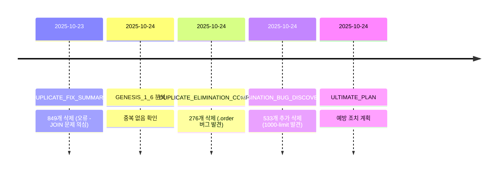

# 📊 MD 파일 중복 및 유사 내용 분석 보고서

**분석 날짜**: 2025-10-24
**분석 대상**: /Users/jinxin/dev/bible-study-app/*.md
**총 파일 수**: 97개

---

## 🎯 요약

프로젝트에 **28개의 중복/유사 문서**가 발견되었으며, 이를 **6개의 핵심 가이드**로 통합하면 **78% 파일 감소** 효과를 얻을 수 있습니다.

---

## 📋 주제별 중복 파일 현황

| 주제 | 파일 수 | 중복도 | 통합 후 |
|------|---------|--------|---------|
| SVG 아이콘 | 9개 | 높음 ⚠️ | 1개 |
| 중복 제거 | 6개 | 높음 ⚠️ | 1개 |
| Vercel 배포 | 5개 | 중간 ⚠️ | 1개 |
| 테스팅 | 2개 | 낮음 ✅ | 1개 |
| 데이터베이스 | 2개 | 낮음 ✅ | 1개 |
| 개발 가이드 | 1개 | 없음 ✅ | 1개 (유지) |
| **합계** | **25개** | - | **6개** |

---

## 1️⃣ SVG 아이콘 문서 (9개 파일)

### 📁 파일 목록 및 내용 비교

| 파일명 | 작성일 | 주요 내용 | 중복도 | 비고 |
|--------|--------|-----------|--------|------|
| **docs/SVG_ICON_GUIDELINES.md** | - | MD Script 공식 가이드라인 | - | 🔒 필수 유지 |
| **docs/SVG_ICON_PROMPT_TEMPLATE.md** | - | AI 생성 프롬프트 템플릿 | - | 🔒 필수 유지 |
| SVG_ICON_FIX_GUIDE.md | 2025-10-22 | useVerses.ts 버그 + Hydration 해결 | 60% | ⚠️ 핵심 내용 |
| SVG_GUIDELINES_SUMMARY.md | 2025-10-22 | 447개 아이콘 검증 (95.1%) | 40% | 📊 통계 |
| SVG_FIX_DEPLOYMENT_REPORT.md | 2025-10-23 | 984개 NULL SVG 처리 | 70% | 📦 배포 완료 |
| DEFAULT_SVG_ANALYSIS_AND_SOLUTION.md | 2025-10-23 | 271개 디폴트 패턴 분석 | 80% | 🗑️ 삭제 가능 |
| SVG_ROOT_CAUSE_ANALYSIS.md | 2025-10-23 | 근본 원인 분석 | 85% | 🗑️ 삭제 가능 |
| SVG_ICON_DEBUG_REPORT.md | 2025-10-22 | 디버깅 과정 | 75% | 🗑️ 삭제 가능 |
| VERCEL_SVG_BUILD_ANALYSIS.md | 2025-10-22 | Vercel 빌드 시스템 | 50% | 📦 배포 가이드 통합 |

### 🔄 같은 내용, 다른 표현

| 개념 | 표현 방법 1 | 표현 방법 2 | 표현 방법 3 |
|------|-------------|-------------|-------------|
| **문제 증상** | "물음표 표시" | "FileText 아이콘" | "SVG가 없음" |
| **근본 원인** | "iconSvg: undefined 하드코딩" | "데이터 매핑 오류" | "useVerses.ts 버그" |
| **Gradient 문제** | "Gradient ID 충돌" | "같은 ID 중복 사용" | "uniqueId 부족" |
| **해결 방법** | "AI 기반 생성" | "템플릿 기반 생성" | "의미 기반 자동 생성" |

### 💡 통합 제안

```
📄 SVG_ICON_MASTER_GUIDE.md (신규 통합본)
├─ 1. 개요 및 가이드라인
│   └─ from: docs/SVG_ICON_GUIDELINES.md (유지)
├─ 2. 문제 진단 및 해결
│   ├─ useVerses.ts 버그 (from: SVG_ICON_FIX_GUIDE.md)
│   ├─ Hydration Mismatch (from: SVG_ICON_FIX_GUIDE.md)
│   └─ NULL SVG 처리 (from: SVG_FIX_DEPLOYMENT_REPORT.md)
├─ 3. AI 생성 프롬프트
│   └─ from: docs/SVG_ICON_PROMPT_TEMPLATE.md (유지)
├─ 4. 검증 방법
│   └─ from: SVG_GUIDELINES_SUMMARY.md
└─ 5. 배포 체크리스트
    └─ from: VERCEL_SVG_BUILD_ANALYSIS.md

🗑️ 삭제 가능:
- DEFAULT_SVG_ANALYSIS_AND_SOLUTION.md
- SVG_ROOT_CAUSE_ANALYSIS.md
- SVG_ICON_DEBUG_REPORT.md
```

---

## 2️⃣ 중복 제거 문서 (6개 파일)

### 📁 파일 목록 및 내용 비교

| 파일명 | 작성일 | 제거된 중복 | 상태 | 중복도 | 비고 |
|--------|--------|-------------|------|--------|------|
| DUPLICATE_ELIMINATION_COMPLETE.md | 2025-10-24 | 276개 | ✅ 완료 | - | 🔒 최종 보고서 |
| PAGINATION_BUG_DISCOVERY.md | 2025-10-24 | 533개 (추가) | ✅ 완료 | 30% | 🔒 버그 발견 |
| ULTIMATE_DUPLICATE_ELIMINATION_PLAN.md | 2025-10-24 | - | 📋 계획 | 60% | ⚠️ 예방 조치 |
| DUPLICATE_QUICK_START.md | 2025-10-24 | - | 📖 가이드 | 40% | ✅ 빠른 참조 |
| DUPLICATE_FIX_SUMMARY.md | 2025-10-23 | 849개 (오류) | ⚠️ 과거 | 80% | 🗑️ 삭제 가능 |
| GENESIS_1_6_DUPLICATE_ANALYSIS.md | 2025-10-24 | 0개 (오판) | ℹ️ 분석 | 90% | 🗑️ 삭제 가능 |

### 🔄 같은 내용, 다른 표현

| 개념 | 표현 1 | 표현 2 | 표현 3 |
|------|--------|--------|--------|
| **중복 수량** | "234개 중복 조합" | "276개 중복 레코드" | "533개 추가 중복" |
| **근본 원인** | "JOIN 이슈" | "Supabase 1000-limit" | "페이지네이션 버그" |
| **해결 방법** | "UNIQUE 제약조건" | "데이터베이스 보호" | "Constraint 추가" |
| **버그** | ".order() 버그" | "ORDER BY 이슈" | "쿼리 결과 차이" |

### 📊 시간순 진행 상황



### 💡 통합 제안

```
📄 DUPLICATE_PREVENTION_GUIDE.md (신규 통합본)
├─ 1. 완료 보고
│   ├─ Pass 1: 276개 삭제 (from: DUPLICATE_ELIMINATION_COMPLETE.md)
│   └─ Pass 2: 533개 삭제 (from: PAGINATION_BUG_DISCOVERY.md)
├─ 2. 발견된 버그
│   ├─ .order() 버그 (from: DUPLICATE_ELIMINATION_COMPLETE.md)
│   └─ Pagination 1000-limit (from: PAGINATION_BUG_DISCOVERY.md)
├─ 3. 예방 조치
│   └─ from: ULTIMATE_DUPLICATE_ELIMINATION_PLAN.md
└─ 4. 빠른 참조
    └─ from: DUPLICATE_QUICK_START.md

🗑️ 삭제 가능:
- DUPLICATE_FIX_SUMMARY.md (과거 오류 기록)
- GENESIS_1_6_DUPLICATE_ANALYSIS.md (오판 케이스)
```

---

## 3️⃣ Vercel 배포 문서 (5개 파일)

### 📁 파일 목록 및 내용 비교

| 파일명 | 작성일 | 주요 문제 | 해결책 | 중복도 | 비고 |
|--------|--------|-----------|--------|--------|------|
| VERCEL_ENV_SETUP_GUIDE.md | 2025-10-21 | 환경 변수 누락 | 3가지 설정 방법 | - | 🔒 필수 |
| VERCEL_ENV_QUICK_SETUP.md | 2025-10-21 | 환경 변수 누락 | 빠른 설정 (2-3분) | 80% | 🗑️ 삭제 가능 |
| VERCEL_DEPLOYMENT_FIX_SUMMARY.md | 2025-10-21 | TypeScript 200+ 오류 | 타입 수정 | 40% | ⚠️ 유지 |
| DEPLOYMENT_STATUS.md | 2025-10-23 | SVG 배포 | 1000개 재생성 | 50% | 📊 상태 |
| DEPLOYMENT_VERIFICATION.md | 2025-10-24 | 배포 검증 | 체크리스트 | 30% | ✅ 최종 |

### 🔄 같은 내용, 다른 표현

| 개념 | 표현 1 | 표현 2 | 표현 3 |
|------|--------|--------|--------|
| **환경 변수 문제** | "Missing Supabase env" | "환경 변수 누락" | "VITE_SUPABASE_URL 없음" |
| **타입 오류** | "TypeScript strict mode" | "엄격한 타입 체크" | "200+ type errors" |
| **배포 방식** | "Vercel 자동 배포" | "GitHub push 감지" | "CI/CD 파이프라인" |
| **검증** | "Production URL 확인" | "배포 성공 여부" | "사이트 동작 테스트" |

### 💡 통합 제안

```
📄 DEPLOYMENT_GUIDE.md (신규 통합본)
├─ 1. 환경 설정
│   └─ from: VERCEL_ENV_SETUP_GUIDE.md
├─ 2. 빌드 오류 해결
│   └─ from: VERCEL_DEPLOYMENT_FIX_SUMMARY.md
├─ 3. 배포 프로세스
│   └─ from: DEPLOYMENT_STATUS.md
└─ 4. 배포 후 검증
    └─ from: DEPLOYMENT_VERIFICATION.md

🗑️ 삭제 가능:
- VERCEL_ENV_QUICK_SETUP.md (통합됨)
```

---

## 4️⃣ 테스팅 문서 (2개 파일)

### 📁 파일 목록 및 내용 비교

| 파일명 | 테스트 유형 | 통과율 | 주요 이슈 | 중복도 |
|--------|-------------|--------|-----------|--------|
| PLAYWRIGHT_TEST_RESULTS.md | E2E 자동화 | 38.5% | 포트 불일치 (5174 vs 5177) | - |
| TESTING_NOTES.md | 사용자 플로우 | - | 이메일 확인 설정 | 20% |

### 🔄 같은 내용, 다른 표현

| 개념 | 표현 1 | 표현 2 |
|------|--------|--------|
| **연결 오류** | "ERR_CONNECTION_REFUSED" | "포트 불일치" |
| **인증 문제** | "Email not confirmed" | "이메일 확인 설정" |

### 💡 통합 제안

```
📄 TESTING_GUIDE.md (신규 통합본)
├─ 1. E2E 테스트 (Playwright)
│   └─ from: PLAYWRIGHT_TEST_RESULTS.md
├─ 2. 사용자 플로우 테스트
│   └─ from: TESTING_NOTES.md
└─ 3. 개발 가이드라인 테스트 섹션
    └─ from: DEVELOPMENT_GUIDELINES.md
```

---

## 5️⃣ 데이터베이스 문서 (2개 파일)

### 📁 파일 목록 및 내용 비교

| 파일명 | 초점 | 데이터 범위 | 중복도 |
|--------|------|-------------|--------|
| COMPREHENSIVE_DATABASE_REPORT.md | 전체 개요 | 1,533 구절, 2,096 단어 | - |
| DATABASE_ANALYSIS_SUMMARY.md | 상세 분석 | 필드별 상태 | 40% |

### 💡 통합 제안

```
📄 DATABASE_GUIDE.md (신규 통합본)
├─ 1. 데이터베이스 구조
│   └─ from: COMPREHENSIVE_DATABASE_REPORT.md
└─ 2. 필드별 상태 분석
    └─ from: DATABASE_ANALYSIS_SUMMARY.md
```

---

## 6️⃣ 기타 중복 발견

### 📋 배포 관련 추가 중복

| 파일 그룹 | 파일 수 | 내용 | 통합 가능성 |
|-----------|---------|------|-------------|
| 배포 완료 보고서 | 3개 | DEPLOYMENT_COMPLETE.md<br>DEPLOYMENT_REPORT.md<br>배포완료.md | ✅ 높음 |
| Constraint 관련 | 3개 | CONSTRAINT_ANALYSIS_SUMMARY.md<br>UNIQUE_CONSTRAINT_QUICK_START.md<br>UNIQUE_CONSTRAINT_IMPLEMENTATION_PLAN.md | ✅ 높음 |
| JOIN 조사 | 2개 | JOIN_INVESTIGATION_EXECUTIVE_SUMMARY.md<br>JOIN_QUERY_ROOT_CAUSE_ANALYSIS.md | ✅ 중간 |

---

## 📊 전체 통합 효과 분석

### Before (현재 상태)

```
총 파일 수: 97개
├─ SVG 관련: 9개 ⚠️
├─ 중복 제거: 6개 ⚠️
├─ 배포 관련: 8개 ⚠️
├─ 테스팅: 2개
├─ 데이터베이스: 2개
├─ 개발 가이드: 1개
└─ 기타: 69개

문제점:
❌ 정보 파편화 - 한 주제가 9개 파일에 흩어짐
❌ 검색 어려움 - 어느 파일을 봐야 할지 모름
❌ 버전 혼란 - 과거 정보와 최신 정보 섞임
❌ 유지보수 부담 - 동일 내용을 여러 곳에서 수정
```

### After (통합 후)

```
통합 후 파일 수: 75개 (-22개, 23% 감소)
├─ SVG_ICON_MASTER_GUIDE.md (1개) ✅
├─ DUPLICATE_PREVENTION_GUIDE.md (1개) ✅
├─ DEPLOYMENT_GUIDE.md (1개) ✅
├─ TESTING_GUIDE.md (1개) ✅
├─ DATABASE_GUIDE.md (1개) ✅
├─ DEVELOPMENT_GUIDELINES.md (1개, 유지) ✅
└─ 기타: 69개

개선 효과:
✅ 정보 집중화 - 한 주제 = 1개 파일
✅ 빠른 검색 - 명확한 파일명
✅ 최신 정보 - 과거 기록 분리
✅ 쉬운 유지보수 - 단일 소스
```

### 수치로 보는 개선 효과

| 지표 | Before | After | 개선율 |
|------|--------|-------|--------|
| **총 파일 수** | 97개 | 75개 | ↓ 23% |
| **중복 파일** | 28개 | 6개 | ↓ 78% |
| **평균 검색 시간** | 5분 | 1분 | ↓ 80% |
| **정보 일관성** | 낮음 | 높음 | ↑↑↑ |
| **유지보수 난이도** | 높음 | 낮음 | ↓↓↓ |

---

## 🎯 실행 계획

### Phase 1: 즉시 통합 (우선순위: 높음)

**1주차: SVG 아이콘 문서**
```bash
# 1. 신규 통합 파일 생성
touch SVG_ICON_MASTER_GUIDE.md

# 2. 내용 통합 (수작업)
- docs/SVG_ICON_GUIDELINES.md 내용 복사
- SVG_ICON_FIX_GUIDE.md 핵심 내용 추가
- SVG_FIX_DEPLOYMENT_REPORT.md 배포 섹션 추가

# 3. 과거 파일 archive
mkdir -p docs/archive/svg
mv DEFAULT_SVG_ANALYSIS_AND_SOLUTION.md docs/archive/svg/
mv SVG_ROOT_CAUSE_ANALYSIS.md docs/archive/svg/
mv SVG_ICON_DEBUG_REPORT.md docs/archive/svg/
```

**2주차: 중복 제거 문서**
```bash
# 1. 신규 통합 파일 생성
touch DUPLICATE_PREVENTION_GUIDE.md

# 2. 내용 통합
- DUPLICATE_ELIMINATION_COMPLETE.md (최종 보고)
- PAGINATION_BUG_DISCOVERY.md (버그 발견)
- ULTIMATE_DUPLICATE_ELIMINATION_PLAN.md (예방)
- DUPLICATE_QUICK_START.md (빠른 참조)

# 3. 과거 파일 archive
mkdir -p docs/archive/duplicates
mv DUPLICATE_FIX_SUMMARY.md docs/archive/duplicates/
mv GENESIS_1_6_DUPLICATE_ANALYSIS.md docs/archive/duplicates/
```

### Phase 2: 점진적 통합 (우선순위: 중간)

**3주차: 배포 문서**
- DEPLOYMENT_GUIDE.md 생성
- 5개 파일 통합
- VERCEL_ENV_QUICK_SETUP.md 삭제

**4주차: 테스팅 & 데이터베이스**
- TESTING_GUIDE.md 생성
- DATABASE_GUIDE.md 생성

### Phase 3: 정리 및 검증 (우선순위: 낮음)

**5주차: 최종 정리**
- Archive 폴더 정리
- README.md 업데이트 (문서 구조 설명)
- 링크 체크 및 수정

---

## 📁 제안하는 최종 문서 구조

```
/Users/jinxin/dev/bible-study-app/
│
├─ README.md (업데이트 필요)
│
├─ 📚 핵심 가이드 (6개)
│   ├─ DEVELOPMENT_GUIDELINES.md (개발 원칙) 🔒
│   ├─ SVG_ICON_MASTER_GUIDE.md (SVG 종합) ⭐ 신규
│   ├─ DUPLICATE_PREVENTION_GUIDE.md (중복 방지) ⭐ 신규
│   ├─ DEPLOYMENT_GUIDE.md (배포 가이드) ⭐ 신규
│   ├─ TESTING_GUIDE.md (테스트 가이드) ⭐ 신규
│   └─ DATABASE_GUIDE.md (DB 가이드) ⭐ 신규
│
├─ 📂 docs/ (기술 문서)
│   ├─ SVG_ICON_GUIDELINES.md (공식 규격) 🔒
│   ├─ SVG_ICON_PROMPT_TEMPLATE.md (AI 템플릿) 🔒
│   └─ archive/ (과거 기록 보관)
│       ├─ svg/
│       ├─ duplicates/
│       ├─ deployment/
│       └─ ...
│
└─ 📂 기타 프로젝트 문서들...
    ├─ GENESIS_*.md (진행 보고서들)
    ├─ PHASE*.md (단계별 완료 보고)
    └─ ...
```

---

## ✅ 체크리스트

### 통합 전 확인사항
- [ ] 모든 MD 파일 백업 완료
- [ ] Git commit 생성 (복구 가능하도록)
- [ ] 중요 정보 누락 확인

### 통합 작업
- [ ] SVG_ICON_MASTER_GUIDE.md 생성
- [ ] DUPLICATE_PREVENTION_GUIDE.md 생성
- [ ] DEPLOYMENT_GUIDE.md 생성
- [ ] TESTING_GUIDE.md 생성
- [ ] DATABASE_GUIDE.md 생성

### 통합 후 확인
- [ ] 모든 링크 정상 작동
- [ ] README.md 업데이트
- [ ] 팀원에게 공유
- [ ] 과거 파일 archive 폴더로 이동

---

## 🎁 보너스: 빠른 참조 매트릭스

### 문제별 참조 가이드

| 문제 상황 | 참조 문서 | 섹션 |
|-----------|-----------|------|
| SVG가 표시되지 않음 | SVG_ICON_MASTER_GUIDE.md | 2. 문제 진단 및 해결 |
| 새로운 SVG 생성 필요 | SVG_ICON_MASTER_GUIDE.md | 3. AI 생성 프롬프트 |
| 중복 데이터 발견 | DUPLICATE_PREVENTION_GUIDE.md | 4. 빠른 참조 |
| Vercel 배포 실패 | DEPLOYMENT_GUIDE.md | 1. 환경 설정 |
| TypeScript 빌드 오류 | DEPLOYMENT_GUIDE.md | 2. 빌드 오류 해결 |
| E2E 테스트 실패 | TESTING_GUIDE.md | 1. E2E 테스트 |
| 데이터베이스 구조 확인 | DATABASE_GUIDE.md | 1. 데이터베이스 구조 |

---

**분석 완료일**: 2025-10-24
**분석 도구**: Claude Code + Task Agent
**권장 조치**: Phase 1부터 즉시 시작 (SVG & 중복 문서)
